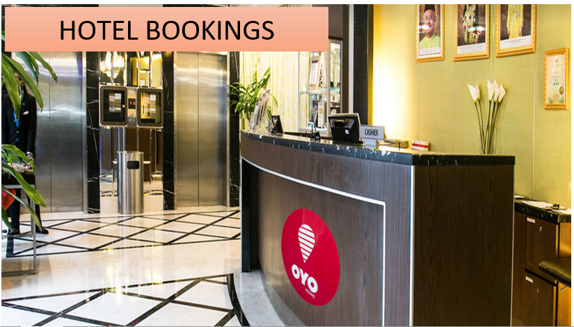

# Hotel Bookings Analysis

## Introduction
This analysis was conducted in Microsoft Excel on actual hotel booking data obtained from Kaggle. The dataset represented data collected between July 2015 and August 2017. Some data elements in some of the fields were represented in code for the sake of anonymity. The focus of this analysis was on the factors affecting the average length of stay (given in days) and the cancellation rate. The total booking count was also measured. This data was collected from two different hotels within the same city - City Hotel and Resort Hotel.

**_Disclaimer_**: _All datasets and reports do not represent my company, institution, or country. The dataset used for the creation of this report can be found for free on [kaggle](https://www.kaggle.com/datasets/mojtaba142/hotel-booking)_

## Business Objectives
1.  How many bookings in total were made (including canceled bookings)?
2.  What is the total average length of stay (in days) for guests at the hotels?
3.  What is the total cancelation rate for the hotels?
4.  Which type of rooms were most frequently reserved?
5.  Do guests prefer to make a down payment or do they prefer to pay on arrival?
6.  Does the hotel type affect how long the guests stay on average?
7.  Does the room type also affect how long guests stay?
8.  Hotel Guests from which countries are likely to stay longer?
9.  How does the cancelation rate vary by room and day of the week?

## Skills Demonstrated
The following Excel Features were incorporated - 
* Macros 
* Dashboard design 
* Pivot Tables and Pivot Charts
* Filters and Filter design
* Data transformation in Excel Power Query
* XLOOKUP Function
* Shapes and Text Boxes

## Data Transformation
-  The raw data were imported into the Power Query Editor
-  Certain columns were transformed thus:
   *  The datatype of the "is_canceled" column was changed to Text and using the replace values functionality, o was replaced with "no" and 1 was replaced with "Yes"
   *  A new column named "Total Guests" by adding the values in each row of the "adult", "children" and "babies" columns
   *  The values in the "is_repeated_guest" column were replaced as follows; 0 for "No" and 1 for "Yes"
   *  The data type of the "Agent" column was changed to text and NULL values were replaced with the text "N/A"
   *  The datatype of the "Company" column was changed to text and NULL values were replaced with the text "N/A"
   *  The "Company" column since most of the values are missing
   *  The "arrival_date_week_number" was dropped since it's not relevant to my analysis
   *  Rows where the number of children is 10, and the number of babies is 9 and 10 were removed since it's just two records and they seemed to be outliers
   *  The rows where the number of children is null were removed since it's just 4 rows
   *  In total, the number of records was cut down from 119390 to 119383 after removing outliers

   

